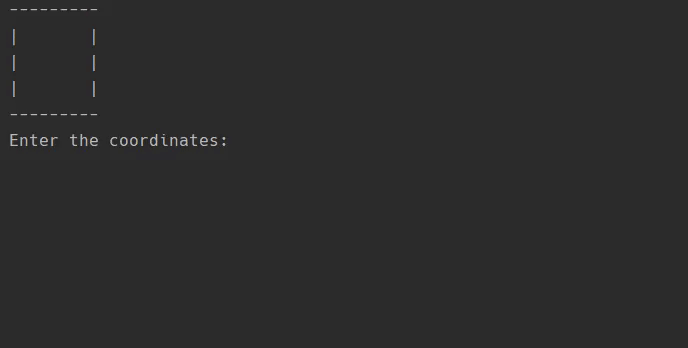

# tic-tac-toe
My solution for the Tic-Tac-Toe on https://hyperskill.org/curriculum  

Please consider not copying and pasting the solution in order to pass the project as that is **BAD!!!**

## Run
- To run the CLI version: `python3 tictactoe.py`
- To run the GUI version: `pip3 install -r requirements.txt && python3 game.py`
